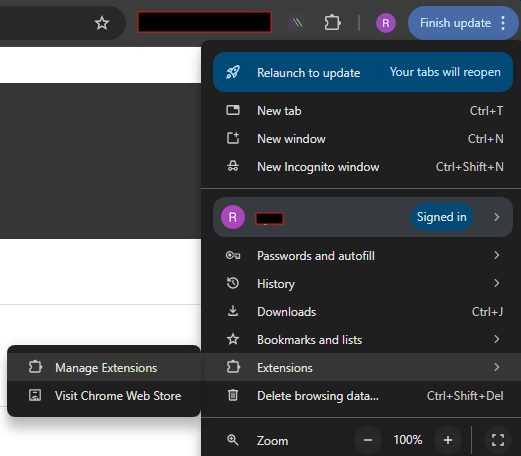
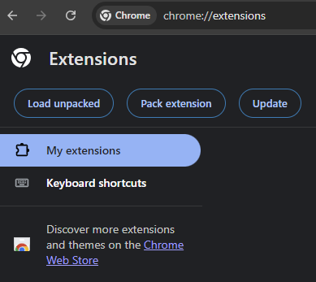
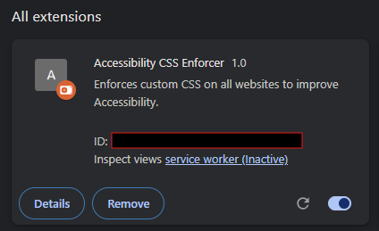

# Kinetic Chrome Plugin

A very basic implementation of a chrome plugin with the intention of applying styles for the sake of accessibility and environment indication.

## Common use

It is not maintained for common use, but acts as a template for anyone who wants to build something something similar. 

## Compatability

Compatable with with Chrome 120+ on Windows and MacOS devices. 

## Using the plugin

#### Local use for development
To develop/use locally, once you have the project, open Chrome and go to Manage extensions




Then click on "Load unpacked"


Select the folder that the project is in. 
This will add the extension, and allow you toenable/disable and manually refresh it whenever a change is made


#### Releasing it into the wild
To enable for others within your organisation, Instead of loading an unpacked extension, you want to click "Pack Extension". This will give you a .crx file.
This can then be globally installed by the system administrator. 

#### Enabling the extension
As soon as the extension is enabled in the extension manager, it will affect any pages which match the urls as per the config.

#### Toggling Optional Styles
- Click on the extension's icon in the extension bar to show the popup with optional style toggles.
- If it is not present in the toolbar, you can click on it under the main extensions list by clicking the puzzle piece icon. 
- Select the styles as desired

## Editing 

The urls are set up in the config.json file. There is space for dev, test, pilot and live. But there is nothing to stop from adding more. It doesn't want to be a full url, but rather something unique which identifies it, this could be the server you are running it on, or part of the url. I have used the /Kinetic/ and /KineticDev/ part of the url. 

*All values should be lower case to enable comparisson to work more easily*

### Editing Styles

To edit the plugin to suit your needs, take a copy of the repository and edit to suit your needs.

#### Default styles

To change the default styling included, edit the stylesheets which already exist. They are kept minimal and separate for ease of maintainance as well as flexibility of use. But this is personal preference. 

#### Adding new styles

To add a new stylesheet:
- Add a .css file to the repository on the same level or within a sub folder as desired.
- Update the manifest.json file to include the new .css file in the array under web_accessible_resources
- Insert the .css file to the page via the content.js file
- If you want these styles to be optional you can add an option to the options page.

Your manifest file should then contain something like the following:
```
...
"web_accessible_resources": [
    {
      "resources": [
        ...,
        "newStyles.css"
      ],
      "matches": ["<all_urls>"]
    }
],
...
```

#### Styling process

To make sure the styles take effect, find as specific a css selector as possible. Ideally including a lot of nesting.

*If this is still not working, it may require you to add !important in order to override everything else including inline styles.*

Keep stylistic changes minimal to reduce the risk of knock-on impact. Don't try to re-skin everything.

## Updating the popup options

If adding toggleable styles, this is currently done directly in the popup for the extension. To add more options:
- Update the popup.html form
- Update the associated JS to handle the save functionality
- Pull the new option into the content.js file
- Toggle adding the new styles absed on the option

